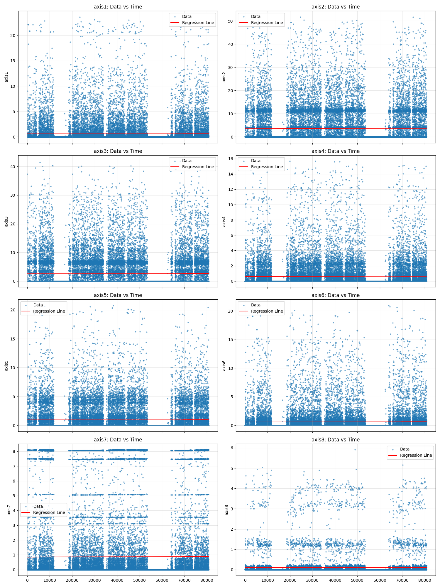
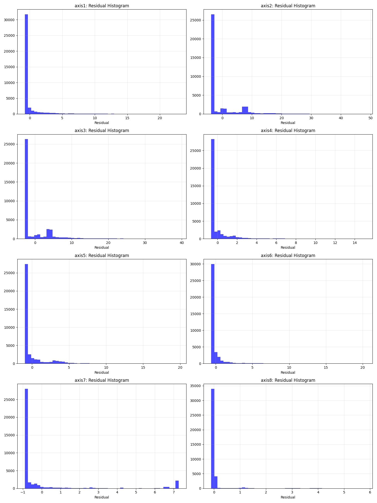
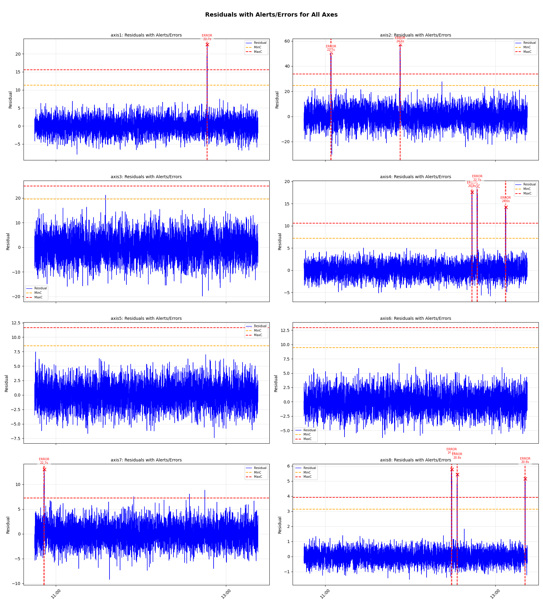

# Practical Lab 1: Streaming Data for Predictive Maintenance with Linear Regression-Based Alerts

## Project Summary
This project implements a predictive maintenance system for industrial current data across eight axes (axis1 to axis8). It extends a streaming data pipeline by integrating linear regression models to detect anomalies in current measurements, which could indicate potential equipment failures. The system:
- Connects to a Neon.tech PostgreSQL database to retrieve training data.
- Fits univariate linear regression models (Time → Axis values) for each axis.
- Analyzes residuals to discover thresholds (MinC, MaxC, T) for alerts and errors.
- Generates synthetic test data with injected anomalies to simulate streaming data.
- Detects alerts (early warnings) and errors (critical issues) based on sustained deviations.
- Visualizes regression fits, residual distributions, and annotated alerts/errors.
- Logs events to CSV for analysis.

The system is designed for predictive maintenance, where early alerts flag trends (e.g., equipment wear) and errors indicate urgent issues (e.g., potential failures). All code is reproducible, with clear setup instructions and justifications for thresholds based on residual analysis.

## Setup Instructions
1. **Clone the Repository**:
   ```bash
   git clone https://github.com/AiswaryaSukumar/CSCN8010_Assignment1.git
   cd CSCN8010_Assignment1
   ```
2. **Install Dependencies**:
   - Ensure Python 3.9 is installed.
   - Create a virtual environment (optional):
     ```bash
     python -m venv .venv
     source .venv/bin/activate  # On Windows: .venv\\Scripts\\activate
     ```
   - Install requirements:
     ```bash
     pip install -r requirements.txt
     ```
3. **Set Up Environment Variables**:
   - Create a `.env` file in the root directory with:
     ```
     PGHOST=<your-neon-tech-host>
     PGPORT=5432
     PGDATABASE=<your-database-name>
     PGUSER=<your-username>
     PGPASSWORD=<your-password>
     PGSSL=require
     ```
   - Replace placeholders with your Neon.tech PostgreSQL credentials.
4. **Run the Notebook**:
   ```bash
   jupyter notebook Streaming_Regression.ipynb
   ```
   - Execute all cells sequentially to:
     - Connect to the database and pull training data.
     - Train regression models and analyze residuals.
     - Define thresholds (MinC, MaxC, T).
     - Generate synthetic test data (`synthetic_data.py`).
     - Simulate streaming and detect alerts/errors.
     - Visualize results and save outputs to `Data/`.
5. **Outputs**:
   - `Data/Training_data.csv`: Training data from DB.
   - `Data/Test_data.csv`: Synthetic test data.
   - `Data/model_params.csv`: Regression slopes/intercepts.
   - `Data/residual_stats.csv`: Residual mean/std per axis.
   - `Data/alerts_errors.csv`: Logged alert/error events.
   - `images/<axis>_residuals_plot.png`: Plots for each axis with alerts/errors.

## Regression and Alert Rules Explanation
### Regression Models
- **Model**: Univariate linear regression (Time_numeric → Axis value) using scikit-learn's `LinearRegression`.
- **Input**: `time_numeric` (seconds since start) as the independent variable.
- **Output**: Predicted current value for each axis (1-8).
- **Process**:
  - Fit models on training data from `staging_measurements` (Neon.tech DB).
  - Compute slopes and intercepts to capture trends (e.g., slight increases/decreases in current).
  - Calculate residuals (actual - predicted) to measure deviations.
  - Save model parameters to `Data/model_params.csv`.

### Residual Analysis
- Residuals are computed as `actual - predicted` for each axis.
- Stats (mean ~0, std ranges 0.4 for axis8 to 6.9 for axis2) show normal distributions (see histograms).
- Z-scores standardize residuals to compare across axes with different scales.
- Plots (scatter with regression lines, residual histograms) reveal outliers and patterns.

### Threshold Discovery
Threshold Discovery
- MinC (Alert threshold): Set at the 95th percentile of positive residuals per axis.
- This means only the top 5% of deviations above the regression line are flagged.
- It helps catch unusual trends early without reacting too much to random noise.

MaxC (Error threshold): Set at the 98th to 99th percentile of positive residuals per axis.
- This captures only the extreme outliers, or the largest 1 to 2% of deviations.
- It ensures that only truly abnormal, potentially critical events are raised as errors.

- T (Time window): A continuous deviation of 10 seconds is needed to confirm an event.

Justification for Percentile Method:

- Residuals vary across different axes; for example, axis2 has a standard deviation of about 6.9, while axis8 has a standard deviation of about 0.4.

- If we used a fixed numeric threshold, such as MinC=2, it might over-flag axis8 (small variance) and under-flag axis2 (large variance).

- Percentiles automatically adjust for these differences, making thresholds specific to each axis and aware of scale.

- Residual histograms show roughly Gaussian-like distributions. Using the 95th and 99th percentiles corresponds to values around 2σ and 3σ from the mean in a normal distribution, which is a common method for detecting outliers.

Predictive maintenance context:

- Alerts (greater than or equal to MinC for greater than or equal to T): signal early unusual consumption, prompting inspection or preventive action.

- Errors (greater than or equal to MaxC for greater than or equal to T): flag critical failures needing immediate intervention.

- Short spikes (less than T seconds) are ignored as noise.

### Alert and Error Rules
- **Alert**: Residual ≥ MinC for ≥ T seconds continuously (early warning for trends).
- **Error**: Residual ≥ MaxC for ≥ T seconds continuously (critical failure indicator).
- **Implementation**:
  - Scan residuals in synthetic test data for consecutive deviations.
  - Log events (axis, start/end index, duration, peak residual, level) to `Data/alerts_errors.csv`.
- **Streaming Simulation**: Process synthetic test data in chunks (100 rows) to mimic real-time data flow.

## Results Screenshots/Plots
Below are key visualizations (see `Streaming_Regression.ipynb` for all outputs):
- **Regression Fits**: Scatter plots of training data with regression lines per axis (axis1 example).  
    <!-- Replace with actual path after running -->
- **Residual Histograms**: Show normal distribution of residuals, guiding threshold selection.  
    <!-- Replace with actual path -->
- **Residuals with Alerts/Errors**: Example for axis1, showing residuals, MinC/MaxC lines, and annotated events.  
  

## Repository Structure
```
├── Data/
│   ├── Training_data.csv
│   ├── Test_data.csv
│   ├── model_params.csv
│   ├── residual_stats.csv
│   ├── events_log.csv
    ├──thresholds_percentile.csv
    ├──thresholds_std.csv
├── images/
    ├──axis1_histograms_plot
    ├──axis1_histograms_plot
       all_axes_residuals_with_alerts_errors
├── Streaming_Regression.ipynb
├── synthetic_data.py
├── requirements.txt
├── .env  # Not committed
├── README.md
```

## Notes
- Ensure `.env` is not committed (add to `.gitignore`).
- Run the notebook fully to generate all CSVs and plots.
- Thresholds are justified in the notebook with plots/stats for predictive maintenance context.
- Synthetic data mimics training metadata (mean/std via residuals_dict) with injected anomalies for testing.

For issues, contact [Your Name] or check the notebook for detailed comments.